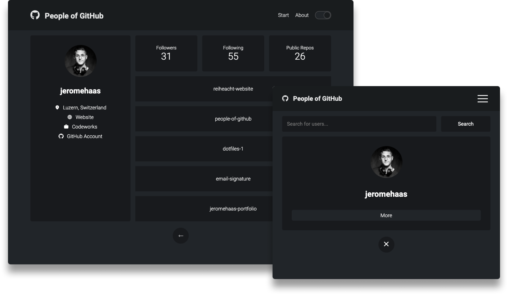

# People of GitHub Web-Application

With this small web-application, you can find users on Github and get some informations above them like:
- Name
- Company
- Email 
- Number of repos
- 5 last updated repos

The application is built in React, Redux and styled components.

The webapplication was inspired by a tuturial of Brad Travery at Udemy. It's not the original web-application, since I modified it and added some features like a theme switcher and some UI approvements.